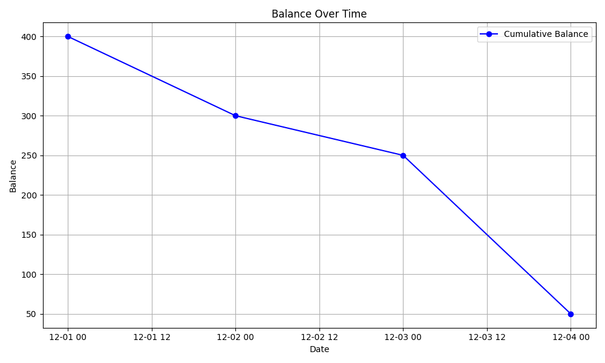

# Personal Budget Tracker

## Overview
The Personal Budget Tracker is a command-line application designed to help users manage their finances effectively. It allows users to record transactions, categorize them, generate reports, and visualize their financial trends over time. This project is developed using Python and employs SQLite for data storage.

---
## Why This App
The Personal Budget Tracker helps me take control of my finances. I wanted to track how much I earn, how much I spend, and how many hours I need to work to reach my financial goals. Whether I’m saving for a vacation, school expenses, or something special, this app helps me stay organized and see my progress clearly.
In the future, I hope to make it even smarter by adding features like predicting expenses, suggesting ways to save, and spotting unusual spending. My goal is to make it a tool that helps anyone feel more confident about managing their money.


## Features
1. **Add Transaction**: Record financial transactions as either income or expenses.
2. **View Transactions**: Display all recorded transactions.
3. **Add Category**: Define categories to organize transactions (e.g., Salary, Groceries, Utilities).
4. **View Categories**: List all existing categories.
5. **Generate Report**: Create a summarized report showing income and expenses by category.
6. **Export Report to CSV**: CSV format
7. **Export Report to Excel**: Excel format
8. **Calculate Balance**: Calculate the net balance (total income minus total expenses).
9. **Plot Balance Over Time**: Generate a graph showing the cumulative balance trend. The graph is automatically saved as balance_plot.png in the project directory.
10. **Exit**: Exit the application.

---

## Installation

### Steps
1. Clone the repository:
   ```bash
   git clone <repository-url>
   cd <repository-folder>
   ```

2. Create a virtual environment:
   ```bash
   python -m venv project_env
   source project_env/bin/activate  # On Windows: project_env\Scripts\activate
   ```

3. Install dependencies:
   ```bash
   pip install -r requirements.txt
   ```

4. Initialize the database:
   ```bash
   python database.py
   ```

---

## Usage

### Run the Application
```bash
python app.py
```

### Menu Options
1. **Add Transaction**:
   - Enter the transaction amount, type (income or expense), category ID, description, and date (YYYY-MM-DD).
2. **View Transactions**:
   - Displays all recorded transactions.
3. **Add Category**:
   - Provide a category name (e.g., "Salary").
4. **View Categories**:
   - Lists all available categories with their IDs.
5. **Generate Report**:
   - Shows income and expenses summarized by category.
6. **Export Report to CSV**:
   - Exports the generated report to a `transactions_report.csv` file.
7. **Export Report to Excel**:
   - Exports the generated report to a `transactions_report.xlsx` file.
8. **Calculate Balance**:
   - Displays the net balance (total income minus total expenses).
9. **Plot Balance Over Time**:
   - Displays a graph of the cumulative balance trend over time.
10. **Exit**:
   - Exits the application.

---

## Project Structure
```
project-folder/
├── app.py               # Main application file
├── database.py          # Database initialization script
├── requirements.txt     # List of required Python packages
├── README.md            # Project documentation
├── models/              # Data model definitions
│   ├── transaction.py   # Transaction model
│   ├── category.py      # Category model
│   └── report.py        # Report generation logic
├── utils/               # Utility functions
│   └── report_utils.py  # Functions for reports and plots
└── budget_tracker.db    # SQLite database (auto-generated)
```

---

## Sample Usage
1. **Add Category**:
   - Input: `Entertainment`
2. **Add Transaction**:
   - Input: `400, income, 1 (The input here should be a number, 1 is the id of salary), "Paycheck", 2024-12-30`
3. **View Transactions**:
   - Output:
     ```
     (1, 400, 'income', 'Salary', 'Paycheck', '2024-12-30')
     ```
4. **Calculate Balance**:
   - Output:
     ```
     Current Balance: $400
     ```
5. **Plot Balance Over Time**:
   - Generates a `balance_plot.png` file and displays the graph.
 


---


